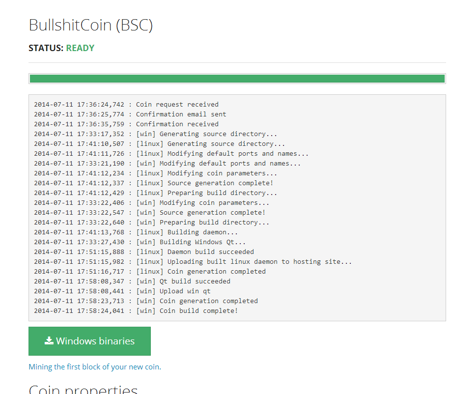
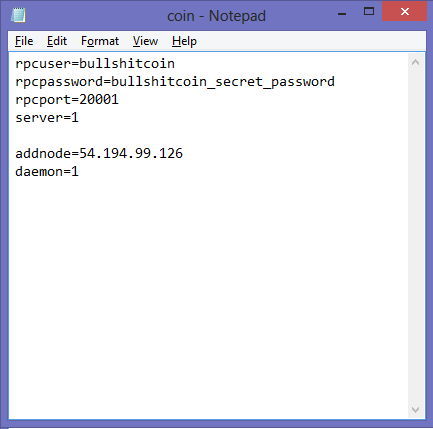
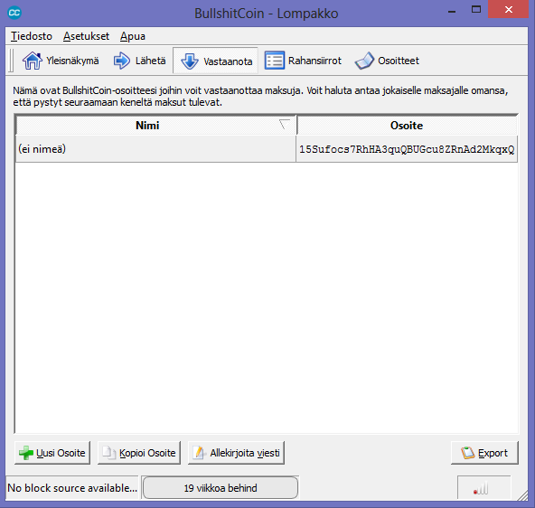
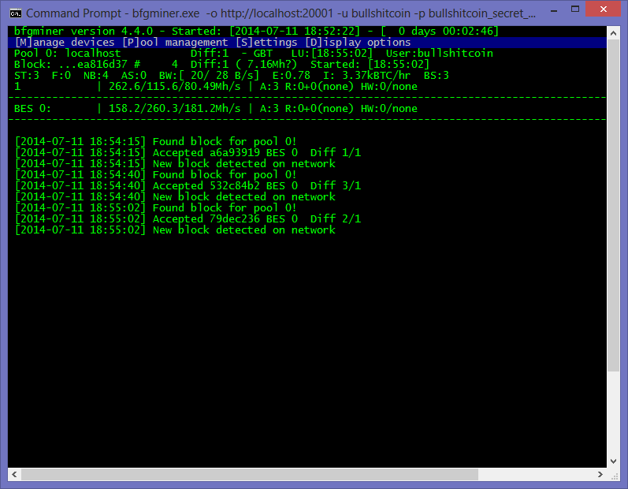

# Mining with BFGMiner (coincreator.net) #
In this guide is shown how to solo mine a coin created by coincreator.

## Prerequisities ##

A coin has been created using our services. This means you must have access to the windows wallet.

## Configure the wallet to accept rpc connections ##

Open the conf file of your wallet. Configure the parameters so that you are able to connect with rpc. The needed parameters are:

`rpcuser` - the username when making the rpc connection

`rpcpassword` - the password when making the rpc connection

`rpcport` - the port where the wallet listens for rpc connections

`server` - tell the wallet to accept rpc connections

So an example conf would look like this:

After that start the wallet and check that you have a connection. We will also need a receival coin address for the connection parameters of the miner. Find or generate a new address from the "receive" tab of your wallet. 

So my address in this tutorial is 15Sufocs7RhHA3quQBUGcu8ZRnAd2MkqxQ. So this is the address to which the miner "sends" the "found" coins.

##Mining with BFGMiner##
Download your favourite version of [bfgminer](http://bfgminer.org). (v. 4.4.0 64bit is used in this tutorial)

Connect to the rpcport of your wallet with the miner. The connection parameters goes like this:

    bfgminer -o http://localhost:port -u rpcuser -p rpcpassword --coinbase-addr my_coin_address

So with the configuration used in this tutorial I would type

    bfgminer.exe -o http://localhost:20001 -u bullshitcoin -p bullshitcoin_secret_password --coinbase-addr 15Sufocs7RhHA3quQBUGcu8ZRnAd2MkqxQ

After the connection I just select the device(s) I want to use and start mining!

And as expected new blocks are found quite often as the difficulty is 1 :)
