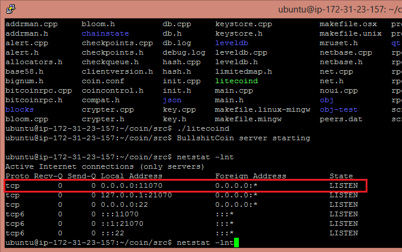

#Setting up a linux daemon (coincreator.net)
In this guide a linux daemon will be build and set up to an Amazon EC2 Ubuntu micro instance and later we will connect to the node using the Windows wallet. Setting up an Amazon micro instance is free and it should handle dozens of connections easily.

 However, it should be noted that the public IP of the instance will change if you restart the instance. For a more "permanent" solution you should have a static permanent IP that won't change. (Amazon offers e.g. "elastic ip's") 

 A coin named BullshitCoin will be used as a demonstration. purpose.

##Prerequisities
A coin has been created using our services. This means you must have the access to the source codes and the windows binary.

 
.

Create a new Ubuntu Server 12.04 32-bit micro instance. If you choose any other distribution, this guide may not work.

 
.

Open the P2P port of your coin from the "security groups". Port 22 should also be open by default so you can connect to your instance with SSH.

 
.

Connect to the linux instance with SSH

 

.

Install dependencies required to build the coin daemon

    sudo apt-get update
	sudo apt-get install build-essential libboost-all-dev libcurl4-openssl-dev libdb5.1-dev libdb5.1++-dev make

Download and unpack the source codes of your coin

    cd
    mkdir coin && cd coin
    wget http://voimariini.s3.amazonaws.com/53247199f98396855ee9e4e2/src-linux.tar.gz
    tar xvf src-linux.tar.gz
    
Compile the coin daemon

    cd ~/coin/src/
    make -f makefile.unix "USE_UPNP=-"

Create a conf file

    echo -e "rpcuser=user\nrpcpassword=passowrd\ndaemon=1" >> coin.conf

Start the daemon

    ./litecoind

Let's check the p2p is open

    netstat -lnt 

 
.

###Now it's time to connect to the server using the Windows wallet!

Add the public ip of your Amazon instance to the conf file the Windows wallet uses

 
.

Now start the Windows wallet!

You can verify from the linux side that indeed someone has connected to your node.

    ./litecoind getinfo

That's it!